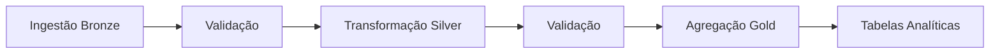

# Arquitetura Medallion

## Visão Geral

O pipeline utiliza a arquitetura Medallion com três camadas distintas:

```
┌─────────────────┐
│  APIs de BH     │
│  Dados Abertos  │
└────────┬────────┘
         │
         ▼
┌─────────────────┐
│  BRONZE LAYER   │  ◄── Dados Brutos (Parquet)
│  - Ônibus       │
│  - MCO          │
└────────┬────────┘
         │
         ▼
┌─────────────────┐
│  SILVER LAYER   │  ◄── Dados Limpos (Delta Lake)
│  - Validação    │
│  - Limpeza      │
│  - Enriquecimento│
└────────┬────────┘
         │
         ▼
┌─────────────────┐
│  GOLD LAYER     │  ◄── Métricas de Negócio (Delta Lake)
│  - Agregações   │
│  - KPIs         │
│  - Análises     │
└─────────────────┘
```

## Camada Bronze

**Objetivo**: Ingestão de dados brutos sem transformações.

**Características**:
- Formato: Parquet (compressão Snappy)
- Particionamento: year/month/day
- Imutabilidade: Dados nunca são alterados
- Retenção: 90 dias

**Datasets**:
- `onibus_tempo_real`: Posicionamento GPS dos ônibus
- `mco`: Mapa de Controle Operacional (linhas e horários)

## Camada Silver

**Objetivo**: Dados limpos, validados e padronizados.

**Características**:
- Formato: Delta Lake
- Particionamento: Por data
- CDC (Change Data Capture): Habilitado
- Retenção: 180 dias

**Transformações**:
- Limpeza de nomes de colunas
- Conversão de tipos de dados
- Validação com Pandera
- Remoção de duplicatas
- Enriquecimento com colunas derivadas
- Score de qualidade

**Tabelas**:
- `onibus_posicoes`: Posições processadas dos ônibus
- `mco_linhas`: Linhas e rotas processadas

## Camada Gold

**Objetivo**: Tabelas analíticas otimizadas para consumo.

**Características**:
- Formato: Delta Lake
- Agregações pré-calculadas
- Métricas de negócio
- Retenção: 365 dias

**Tabelas Analíticas**:

1. **velocidade_media_por_linha**
   - Velocidade média, mediana, min, max por linha/data
   - Desvio padrão
   - Total de registros

2. **onibus_ativos_por_periodo**
   - Total de ônibus únicos por hora
   - Distribuição por período do dia
   - Análise por dia da semana

3. **cobertura_geografica**
   - Área de cobertura por linha
   - Coordenadas médias, mínimas e máximas
   - Total de pontos coletados

4. **pontos_criticos_velocidade**
   - Identificação de gargalos
   - Grid geográfico com baixa velocidade
   - Classificação por severidade

## DataOps e Governança

### Qualidade de Dados

- **Validação em tempo real** com Pandera
- **Regras de negócio**:
  - Coordenadas dentro de BH (-20.0 a -19.7, -44.1 a -43.8)
  - Velocidade não negativa e < 120 km/h
  - Timestamps válidos

### Linhagem de Dados

- Rastreamento de origem e transformações
- Metadados de processamento
- Timestamps de criação/atualização

### Monitoramento

- Logs estruturados
- Métricas de execução
- Alertas de qualidade

### Auditoria

- Histórico de validações
- Score de qualidade por dataset
- Registro de erros e exceções

## Fluxo de Execução



## Performance

- **Paralelização**: Múltiplas fontes processadas concorrentemente
- **Particionamento**: Otimiza leitura e escrita
- **Delta Lake**: Suporta ACID transactions e time travel
- **Compressão**: Reduz armazenamento e I/O
